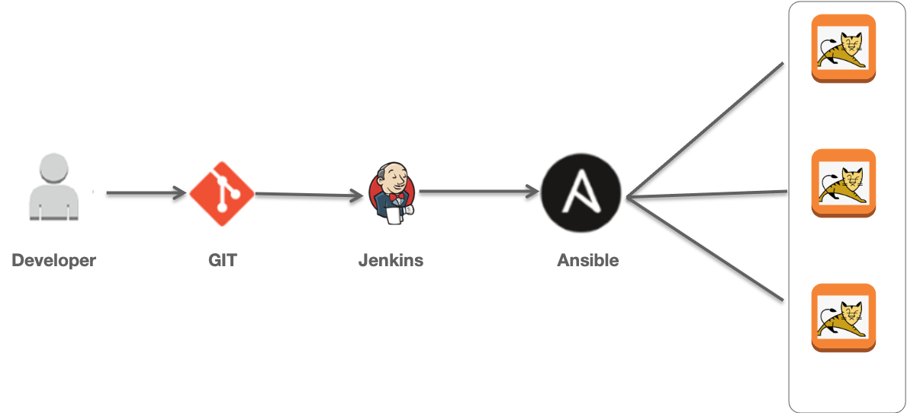
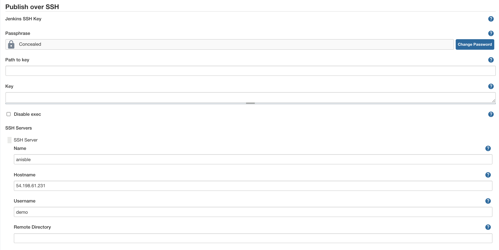
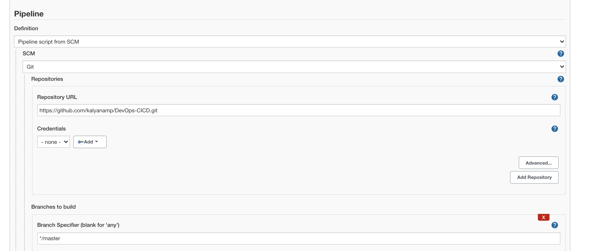

# DevOps-CICD 
Jenkinsfile CICD Pipeline 

GIT ---> Jenkins --> Ansible -->Tomcat 

# Prerequisites
Ansible Installation

#create user(demo) all server with root permissions
#ubuntu root user group permissions

Below command addes ansadmin to sudoers file. But strongly recommended to use "visudo" command if you are aware vi or nano editor. 

`echo "demo ALL=(ALL) ALL" >> /etc/sudoers`

#install python

#install ansible

#centos,redhost

`yum install ansible`

#ubuntu

`sudo apt-get install ansible`

#Aws 

`sudo amazon-linux-extras install ansible2`

#create ansible invertory hosts

cat hosts

[web]
172.31.25.30
172.31.27.56

# test host connection 
`ansible -i hosts all -m ping -u demo`

### Ansible  Integration Setps jenkins

Install "publish Over SSH"
 - `Manage Jenkins` > `Manage Plugins` > `Available` > `Publish over SSH` 

Enable connection between Ansible and Jenkins

- `Manage Jenkins` > `Configure System` > `Publish Over SSH` > `SSH Servers` 

#### Jenkins pipeline job job 

update your tomcat host details in  hosts

