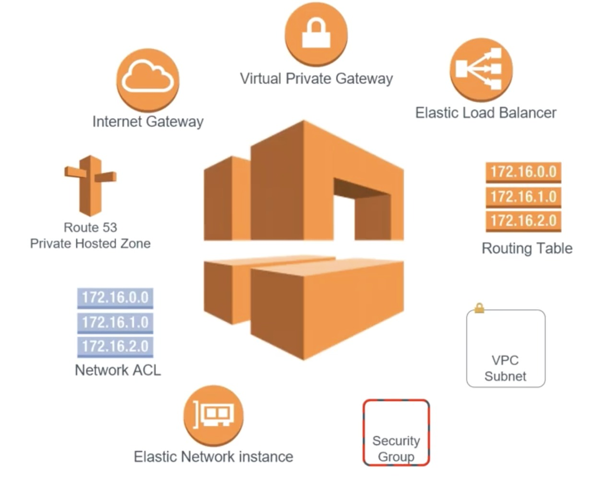
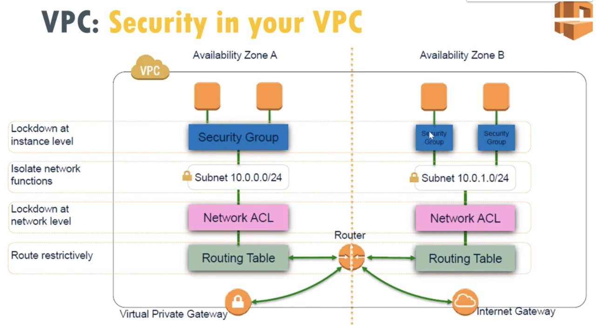

#AWS network Project from scratch 

 

#VPC:

name - KMP-VPC

10.0.0.0/16

#Subnet 

name - KMP-Public

10.0.1.0/24

name - KMP-Private:

10.0.2.0/24

#Internat gateway

KMP-IGW

#attach to vips  KMP-IGW -->KMP-VPC 

#route table

KMP-private route

KMP-public route

#NAT
KMP-NAT

Create NAT with public Subnet and elastic IP

#Nat attach private routing table

#routs
0.0.0.0  target- nata

Next
-->attach  private routing to private subnet

#Internet gateway add to public route and public subnet 

0.0.0.0 --> kmp-igw

Reference : Build AWS Multi-Tier Architecture Project from scratch
https://www.youtube.com/watch?v=E-WdMk7_IQo&list=LL

https://hackernoon.com/manage-aws-vpc-as-infrastructure-as-code-with-terraform-55f2bdb3de2a

#security 

#Network NACL

